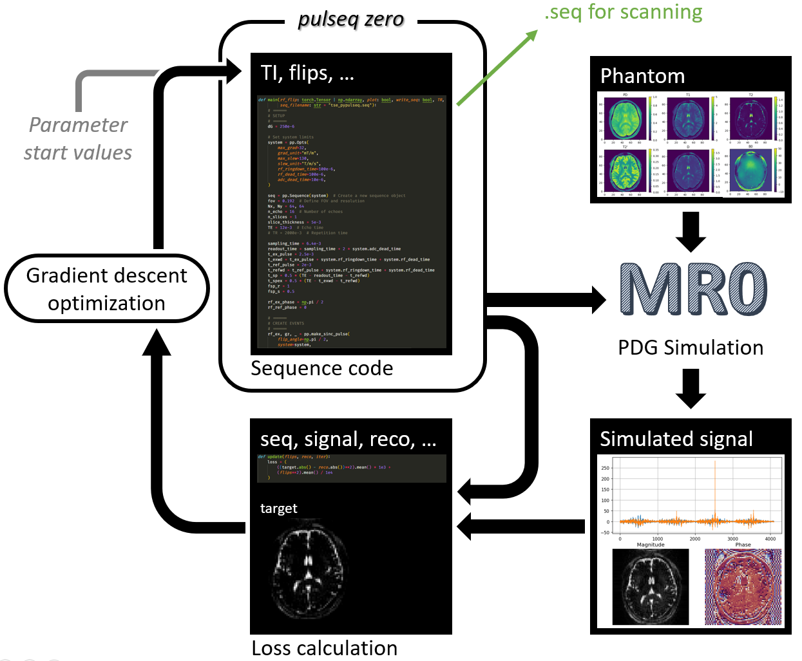
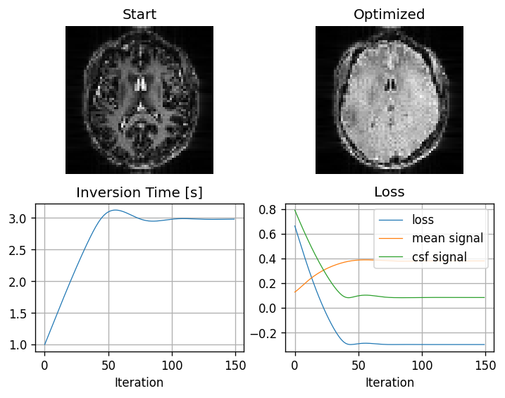
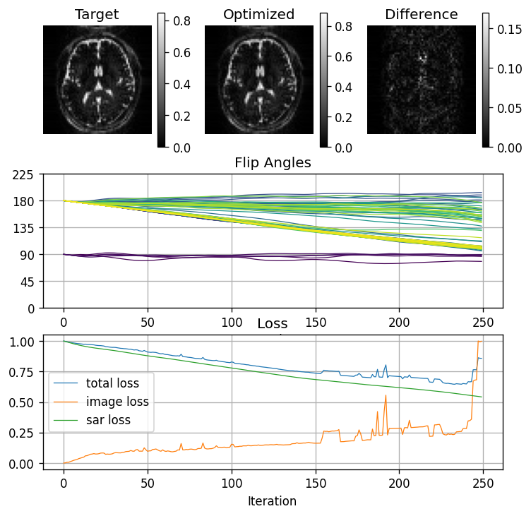

# Pulseq-zero: PyPulseq sequence scripts in a differentiable optimization loop
Jonathan Endres, Moritz Zaiss

## Summary (291/300)
By wrapping PyPulseq, MRI sequence scripts using this library can be integrated into the differentiable MR-zero framework.
Sequence optimization only requires defining a loss function and changing the script to depend on the optimized parameters, while the seq file export is never changed. 

## Abstract (4985/5000)
### Introduction (753)
MRI sequences are often defined in terms of many parameters, whose values are often highly customizable without a clear optimal choice.
MR-zero[1] provides an answer to this choice with its fast and fully differentiable simulation, by allowing optimization of flip angles, inversion times, timings, and more.
Flexible losses can be defined, such as difference from target contrasts or SNR/SAR losses.
Until now, MR-zero used its own internal sequence definition.
With Pulseq-zero we expand MR-zero to deeply integrate with the widely adopted Pulseq[2] standard.
This enables optimization of any PyPulseq[3] script, only requiring minimal modifications and not manipulating the export and measurement of the programmed and optimized sequences in any way.

### Methods (2746)
Pulseq-zero provides an interface that is fully compatible with PyPulseq.
Existing PyPulseq scripts only need to change imports and then be modified to wrap the sequence definition in a function that accepts the parameters that are to be optimized as arguments.
When executing this function as-is, PyPulseq is used and the exported .seq file is identical to before.
In contrast, when executing it in the Pulseq-zero context, the implementation is swapped.
Behind the scenes, an MR-zero sequence is built from the PyPulseq calls that directly depends on the parameters passed as arguments to the sequence function.
This sequence can then be further processed by MR-zero to simulate a signal with its fast and physically correct PDG simulation[4] and reconstruct an image from it.

The whole process is fully differentiable: By using PyTorch[5] tensors as the sequence parameters, backpropagation is used to calculate gradients for all inputs with respect to the final loss.
This is possible since Pulseq-zero, as well as simulation and reconstruction are all executed as an uninterrupted stream of continuous tensor operations.
The only requirement for optimizing a PyPulseq sequence script is providing a function that returns a loss value based on the sequence parameters and the reconstructed image for the current iteration, both of which are provided by Pulseq-zero.
Then, a single call to Pulseq-zero optimize function with the sequence building and loss function as arguments is needed to automatically optimize all parameters.
This process is visualized in Figure 1.

To demonstrate the ease of optimizing existing PyPulseq sequences, the PyPulseq TSE and EPI example scripts were used.
The EPI sequence was extended by a preceding inversion pulse and a variable time between it and the excitation pulse, defined by the inversion time parameter.
The goal of the optimization is to achieve fluid suppression by adjusting the inversion time, starting at 1 s.
The loss function is therefore defined to minimize the CSF signal with regard to the average brain signal.

For the second example, the TSE sequence was modified so that all flip angles are defined as a parameter, with 90° and 180° as starting values for excitation and refocusing pulses.
The loss function is given by the quadratic difference between the reconstruction of the sequence with the start values and the sequence with the optimized flip angles, summed with an SAR estimation, calculated by summing the squared flip angles.
Minimizing this loss means trying to lower all RF amplitudes while still keeping the resulting image close to the original.

Both sequences were executed as single-slice with a resolution of 64² on a quantified brain phantom[6] with a resolution of 96².

### Results (775 /774)
Applying the Pulseq-zero optimization loop (figure 1) to the EPI sequence leads to the results shown in figure 2. An appropriate inversion time for fluid suppression was found. While this specific example is easy to compute analytically, a quick convergence of the optimization process is demonstrated. Loss functions can be constructed to target any desired tissue contrast to automatically adjust sequences accordingly, taking all dynamics influencing the image into account.

Figure 2 shows the results of the TSE optimization. Convergence is worse as image artifacts can be very sensitive to small changes in the flip angles, while the SAR loss is much more stable. Nevertheless, SAR could be reduced by nearly half without degrading the image quality in a noticeable way. 

### Discussion (711)
With Pulseq-zero, sequences can be written directly using the widely adopted PyPulseq library.
This means that next to no additional learning is needed when using MR-zero to optimize any sequence, and no restrictions are enforced in how to parameterize it.
For optimization, only a loss function is necessary which describes the optimization goals.
With this approach, the users can fully focus on the development of sequences instead of the simulation setup.
In addition, because the sequence definition is fully compatible with PyPulseq , exporting it using the widely adopted standard and measuring on one of the many systems supported by Pulseq is possible without any modifications to the sequence script. 
 
## References
1. Loktyushin A, Herz K, Dang N.: MRzero - Automated discovery of MRI sequences using supervised learning. Magn Reson Med. 2021; 86: 709–724. doi: 10.1002/mrm.28727
2. Layton, K.J., Kroboth, S., Jia, F., Littin, S., Yu, H., Leupold, J., Nielsen, J.-F., Stöcker, T. and Zaitsev, M. (2017), Pulseq: A rapid and hardware-independent pulse sequence prototyping framework. Magn. Reson. Med., 77: 1544-1552. doi: 10.1002/mrm.26235
3. Keerthi SR, Geethanath S, Vaughan J: PyPulseq: A Python Package for MRI Pulse Sequence Design. Journal of Open Source Software 4.42 (2019): 1725.
4. Endres J, Weinmüller S, Dang HN, Zaiss M: Phase distribution graphs for fast, differentiable, and spatially encoded Bloch simulations of arbitrary MRI sequences. Magn Reson Med. 2024 Apr 4. doi: 10.1002/mrm.30055
5. Paszke A. et al: PyTorch: An Imperative Style, High-Performance Deep Learning Library. doi: 10.48550/arXiv.1912.01703
6. qMRI abstract

## Figures (827/1000)

Figure 1:
By wrapping any PyPulseq script into Pulseq-zero, it can be integrated into the MR-zero optimization loop:
parameters used for the sequence definition are traced through the whole simulation and loss calculation, which can be based on sequence properties or the reconstructed image.
Backpropagation of the final loss allows to efficiently optimize the sequence parameters with gradient descent.

Figure 2:
Automatic FLAIR:
The time between an initial inversion pulse and the excitation pulse of the subsequent EPI readout is adjusted in order to minimize the CSF signal with regard to the average brain signal.

Figure 3:
TSE flip angle optimization with the goal of minimizing SAR while keeping the reconstruction close to the original sequence.
At iteration 233, SAR could be reduced by 43%, only afterwards the image quality started to deteriorate.
